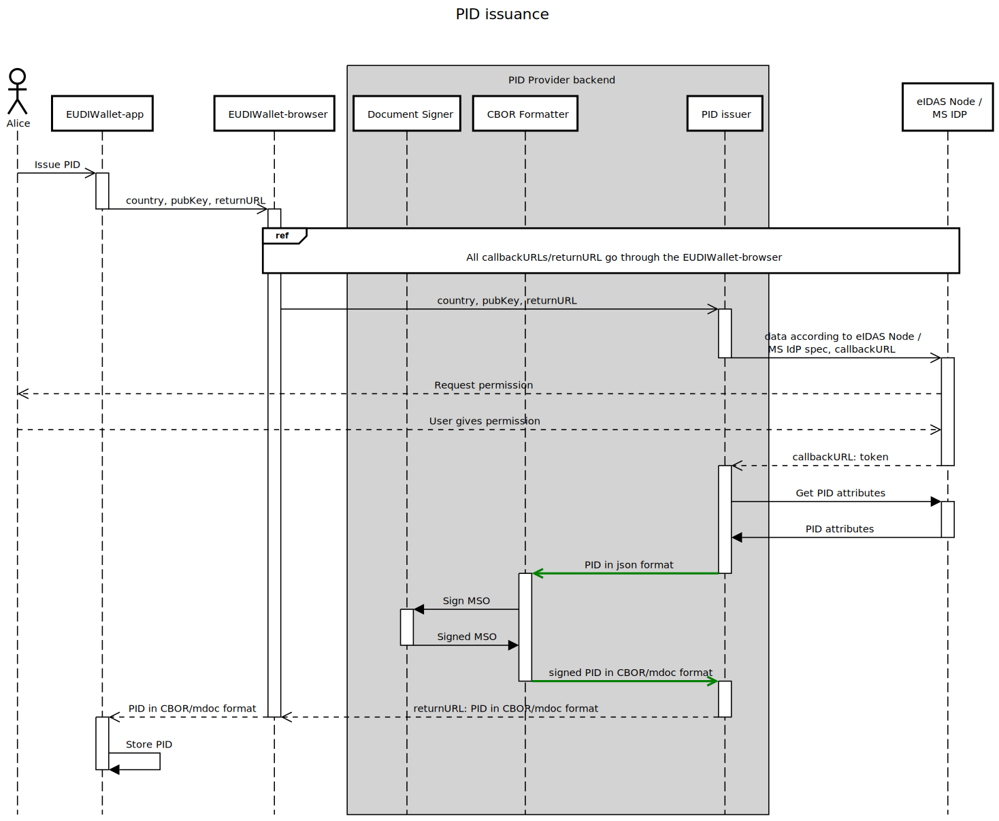

# CBOR Formatter

Receives a JSON format as input data and returns the signed mdoc (ISO 18013-5 mdoc) in cbor format.




## 1. Web Service APIs

+ Pre-production / tests URL: <https://issuer.eudiw.dev/>

### 1.1 Format and sign PID in mdoc/CBOR format

The request contains the API version, Issuer country, doctype and the PID data (one or more namespaces are allowed) in JSON format.

The response contains the PID in mdoc/cbor format, error_code and error_message.

#### 1.1.1 (POST) formatter/cbor request

Format and sign the PID in CBOR (ISO 18013-5 mdoc) format.

+ Pre-production / tests URL: <https://issuer.eudiw.dev/formatter/cbor>

The **formatter/cbor** POST request contains the following JSON body:

+ *version* (mandatory) - API version
+ *country* (mandatory) - Two-letter country code according to ISO 3166-1 alpha-2. The signature of the PID will be done with the corresponding country document signing key.
+ *doctype* (mandatory) - mdoc doctype
+ *device_publickey* (mandatory) - User's device public key (PEM format, base64 urlsafe encode)
+ *data* (mandatory) - doctype data "dictionary" with one or more "namespace": {"namespace data and fields"} tuples
+ *signature* (optional) - "dictionary" with the following fields: "signing_certificate_hash", "signed_country", "signed_doctype", "signed_data". Purpose of this field is twofold:
  + formatter/cbor request can only be performed by allowed entities;
  + non-repudiation of the formatter/cbor request.


Supported API *version*, for testing:

+ 0.3 - Returns the signed mdoc in cbor format. *signature* field is optional and is not verified.

Supported *doctype*, for testing:

+ eu.europa.ec.eudiw.pid.1

Available *country* codes, for testing:

+ FC (Form country) - a form, with the necessary PID attributes, will be presented to the user (EUDI Wallet holder). The user will insert the values, that will not be verified;
+ CW (country W) - the user will be redirected to the eIDAS node of country W (- info to be added on how to test it -);
+ CZ (Czech Republic) - the user will be redirected to the eIDAS node of Czech Republic (- info to be added on how to test it -);
+ EE (Estonia) - the user will be redirected to the Identity Provider of Estonia (- info to be added on how to test it -);
+ PT (Portugal) - the user will be redirected to the Identity Provider of Portugal (- info to be added on how to test it -).

##### 1.1.1.1 Example

URL (Pre-production / tests): <https://issuer.eudiw.dev/formatter/cbor>

Body:

```
{
    "version":"0.2",
    "country":"DE",
    "doctype":"eu.europa.ec.eudiw.pid.1",
    "data":{
        "eu.europa.ec.eudiw.pid.1":{
            "family_name": "Garcia", 
            "given_name": "javier", 
            "birth_date": "1965-01-01", 
            "age_over_18": true, 
            "unique_id": "86b73c6c-7542-4923-a986-97d2cdf7f07a",
            "issuance_date": "2023-07-19",
            "expiry_date": "2023-08-19",
            "issuing_authority": "Bundes...",
            "issuing_country": "DE"
        },
        "eu.europa.ec.eudiw.de.1":{
            "signature_usual_mark": "a36776657273696f6e63312e3069696f6e63312e3069646f6375e..."
        }
    },
    "signature": {
        "signing_certificate_hash": "a696f6e63312e3069646f6375...", 
        "signed_country": "a696f6e63312e3069646f6375...", 
        "signed_doctype": "a312e3069646f63756d656e...", 
        "signed_data": "a367766572736966e..."
    }
}
```

#### 1.1.2 (POST) formatter/cbor response

Returns the PID in mdoc/cbor format, error_code and error_message in a JSON object:

+ *mdoc* - signed cbor encoded 18013-5 mdoc (in base 64 urlsafe encode).
+ *error_code* - error number. 0 if no error. Additional errors defined below. If error != 0, mdoc field may have an empty value.
+ *error_message* - Error information.

Error codes (available in the [API error code file](error.md))

##### 1.1.2.1 Examples

**Response example**

JSON with error code, error message and signed Cbor encoded 18013-5 mDOC

Example:
```
{
    "error_code": 0,
    "error_message": "",
    "mDoc": "o2d2ZXJzaW9uYzEuMGlkb2N1bWVudHOBomdkb2NUeXBleBhldS5ldXJvcGEuZWMuZXVkaXcucGlkLjFsaXNzdWVyU2lnbmVkompuYW1lU3BhY2VzongYZXUuZXVyb3BhLmVjLmV1ZGl3LnBpZC4xidgYWGCkaGRpZ2VzdElEAGZyYW5kb21YIDXHA68s7oM4Hp8pZPTfaBtiNr2+aq4kUIof3/Jv3KgKcWVsZW1lbnRJZGVudGlmaWVya2FnZV9vdmVyXzE4bGVsZW1lbnRWYWx1ZfXYGFhlpGhkaWdlc3RJRAFmcmFuZG9tWCDRW40OW14CtRYY3YIABKt7lRRP5qfLUkUNta1RMNssrnFlbGVtZW50SWRlbnRpZmllcmpnaXZlbl9uYW1lbGVsZW1lbnRWYWx1ZWZqYXZpZXLYGFhmpGhkaWdlc3RJRAJmcmFuZG9tWCDFNwrx2q0EUQgg6tYdbTM2Tdq4xyLyKeSFTkoYWNYpkXFlbGVtZW50SWRlbnRpZmllcm9pc3N1aW5nX2NvdW50cnlsZWxlbWVudFZhbHVlYkRF2BhYbKRoZGlnZXN0SUQDZnJhbmRvbVgg0V7JXrPtB4Tnm01mXqW1IN+/vBZQQ6DFntSlw9ORxLtxZWxlbWVudElkZW50aWZpZXJtaXNzdWFuY2VfZGF0ZWxlbGVtZW50VmFsdWVqMjAyMy0wNy0xOdgYWIOkaGRpZ2VzdElEBGZyYW5kb21YIM9vYxOXqNGCgh0hun8KE/XWNF+Wdo3Kk81S9HRbKnwWcWVsZW1lbnRJZGVudGlmaWVyaXVuaXF1ZV9pZGxlbGVtZW50VmFsdWV4JDg2YjczYzZjLTc1NDItNDkyMy1hOTg2LTk3ZDJjZGY3ZjA3YdgYWGakaGRpZ2VzdElEBWZyYW5kb21YIJvh+GNJMXVyBwyCAbJhbezjt56btNu/1ldgDsLyjpnbcWVsZW1lbnRJZGVudGlmaWVya2ZhbWlseV9uYW1lbGVsZW1lbnRWYWx1ZWZHYXJjaWHYGFhspGhkaWdlc3RJRAZmcmFuZG9tWCDge80zxATuRVjL5zHhl3N4V7nMb+pHdQeYRQgYk5kbhnFlbGVtZW50SWRlbnRpZmllcmpiaXJ0aF9kYXRlbGVsZW1lbnRWYWx1ZdkD7GoxOTY1LTAxLTAx2BhYb6RoZGlnZXN0SUQHZnJhbmRvbVggs8W2ZzPTbgZPREsjiEtX5Sm+eXXd9JPcAcfDl95GK0JxZWxlbWVudElkZW50aWZpZXJxaXNzdWluZ19hdXRob3JpdHlsZWxlbWVudFZhbHVlaUJ1bmRlcy4uLtgYWGqkaGRpZ2VzdElECGZyYW5kb21YIKwSaaugrfyikX0dZryTCXDDrymrWQOZm4bGU09IYFlycWVsZW1lbnRJZGVudGlmaWVya2V4cGlyeV9kYXRlbGVsZW1lbnRWYWx1ZWoyMDIzLTA4LTE5d2V1LmV1cm9wYS5lYy5ldWRpdy5kZS4xgdgYWJekaGRpZ2VzdElECWZyYW5kb21YIH5Z2FHpYmQSdLVn0JDxEdnS06S27u6Jwx3bs0VTSqJhcWVsZW1lbnRJZGVudGlmaWVydHNpZ25hdHVyZV91c3VhbF9tYXJrbGVsZW1lbnRWYWx1ZXgtYTM2Nzc2NjU3MjczNjk2ZjZlNjMzMTJlMzA2OTY0NmY2Mzc1NmQ2NTZlLi4uamlzc3VlckF1dGiEQ6EBJqEYIVkCpzCCAqMwggIooAMCAQICFFCvBzBpvmxyheSAobrs/CBcPjdvMAoGCCqGSM49BAMCMD4xHDAaBgNVBAMME0lBQ0EgbURMIFJvb3QgLSAwMDExETAPBgNVBAoMCERHIENORUNUMQswCQYDVQQGEwJMVTAeFw0yMzA1MjUxOTMxMjFaFw0yNDA4MTcxOTMxMjBaMDwxGjAYBgNVBAMMEUlBQ0EgbURMIERTIC0gMDAxMREwDwYDVQQKDAhERyBDTkVDVDELMAkGA1UEBhMCTFUwWTATBgcqhkjOPQIBBggqhkjOPQMBBwNCAASmAlJ/vsozWCIjXImfArUNPMhTS+fHhPiAK5sS6ucm8nV2yXr+jI6/ntHZF63dPEiI7YoJcwcn2XsWprRa3Lwgo4IBBDCCAQAwHwYDVR0jBBgwFoAUmlj4RBwlEycPjwlieDmwaCXwukwwFQYDVR0lAQH/BAswCQYHKIGMXQUBAjA4BgNVHR8EMTAvMC2gK6AphidodHRwczovL2V1ZGl3LnByb2pqLmV1L2NybC9pYWNhX21kbC5jcmwwHQYDVR0OBBYEFA7iqWkrzS+vRt4XcWYGjaxIAM0VMA4GA1UdDwEB/wQEAwIHgDBdBgNVHRIEVjBUhlJodHRwczovL2dpdGh1Yi5jb20vZXUtZGlnaXRhbC1pZGVudGl0eS13YWxsZXQvYXJjaGl0ZWN0dXJlLWFuZC1yZWZlcmVuY2UtZnJhbWV3b3JrMAoGCCqGSM49BAMCA2kAMGYCMQCmEz171D57i72EMOIY0RpR3PKvX0e7Et3EB3P+cfDt8mO7/KmbEV4PeKe9hJ8/qiUCMQDPg8tENhLMH8NfSkakID5Pcy5+GJ8uICPs1O+Gf1Ff0AyLoe8iCw0Ka+WEUownLuRZAsDYGFkCu6ZnZG9jVHlwZXgYZXUuZXVyb3BhLmVjLmV1ZGl3LnBpZC4xZ3ZlcnNpb25jMS4wbHZhbGlkaXR5SW5mb6Nmc2lnbmVkwHQyMDIzLTA3LTIxVDA4OjQ3OjM5Wml2YWxpZEZyb23AdDIwMjMtMDctMjFUMDg6NDc6MzlaanZhbGlkVW50aWzAdDIwMjgtMDctMTlUMDg6NDc6MzlabHZhbHVlRGlnZXN0c6J4GGV1LmV1cm9wYS5lYy5ldWRpdy5waWQuMakAWCC3pAzWOchdyVCbUgTPsB2LGLUMjuWFOe30h7OL7m3CKQFYIOdOCX32xSdgQ99ZEgxu4TGWZL7i5WaHENI9aqEKebiQAlggftg4Myh0WO1jMNp0i03LuJeAzZIY2tNkg7oY5i27T8QDWCBLFohbnoWBLDOQxZDJZUdE5sGi8MUPh9qsJDFbfxeOHgRYIPTR6jqyl1L62/pCZVITy5eu3uEzlFseysQd1DDT5T2JBVgg16w0x3tZnnA8neviG+I3xTKHxBtBjfMgzdwYI4ZnW8oGWCCEpqmhLMnSVfMToj1kkEHff2KxIEuUAGfQA4qBZcIlbAdYIKBEoSQDhNiBJYlbvEX0J+CrI601bCUHXN+dLAPn4RP0CFggN9EBIooYohQrnzpR7VxV5bxhRnN4BCY6nuU+jLBNEFt3ZXUuZXVyb3BhLmVjLmV1ZGl3LmRlLjGhCVggsSS7PgoPCatYXh2aZZmrDnw2NHJjhN+wEjRaFOWhVuxtZGV2aWNlS2V5SW5mb6FpZGV2aWNlS2V5pAECIAEhWCJYIKYCUn++yjNYIiNciZ8CtQ08yFNL58eE+IArmxLq5ybyIlgiWCB1dsl6/oyOv57R2Ret3TxIiO2KCXMHJ9l7Fqa0Wty8IG9kaWdlc3RBbGdvcml0aG1nU0hBLTI1NlhAdBJ6dVW4X4O2lvIFvlPIP1cvV/KMcSonHnlReOdtsrySQMw0qJcriirnMU/EZUteIzvhyrcqKktnl4poQ+Kk3mZzdGF0dXMA"
}
```


**Diagnostic Notation ISO 18013-5 Cbor mDOC of the value of the mdoc field in the above response**

Example:

```
{
    "version": "1.0",
    "documents": [
        {
            "docType": "eu.europa.ec.eudiw.pid.1",
            "issuerSigned": {
                "nameSpaces": {
                    "eu.europa.ec.eudiw.pid.1": [
                        24_0(<<{
                            "digestID": 0,
                            "random": h'35c703af2cee83381e9f2964f4df681b6236bdbe6aae24508a1fdff26fdca80a',
                            "elementIdentifier": "age_over_18",
                            "elementValue": true,
                        }>>),
                        24_0(<<{
                            "digestID": 1,
                            "random": h'd15b8d0e5b5e02b51618dd820004ab7b95144fe6a7cb52450db5ad5130db2cae',
                            "elementIdentifier": "given_name",
                            "elementValue": "javier",
                        }>>),
                        24_0(<<{
                            "digestID": 2,
                            "random": h'c5370af1daad04510820ead61d6d33364ddab8c722f229e4854e4a1858d62991',
                            "elementIdentifier": "issuing_country",
                            "elementValue": "DE",
                        }>>),
                        24_0(<<{
                            "digestID": 3,
                            "random": h'd15ec95eb3ed0784e79b4d665ea5b520dfbfbc165043a0c59ed4a5c3d391c4bb',
                            "elementIdentifier": "issuance_date",
                            "elementValue": "2023-07-19",
                        }>>),
                        24_0(<<{
                            "digestID": 4,
                            "random": h'cf6f631397a8d182821d21ba7f0a13f5d6345f96768dca93cd52f4745b2a7c16',
                            "elementIdentifier": "unique_id",
                            "elementValue": "86b73c6c-7542-4923-a986-97d2cdf7f07a",
                        }>>),
                        24_0(<<{
                            "digestID": 5,
                            "random": h'9be1f86349317572070c8201b2616dece3b79e9bb4dbbfd657600ec2f28e99db',
                            "elementIdentifier": "family_name",
                            "elementValue": "Garcia",
                        }>>),
                        24_0(<<{
                            "digestID": 6,
                            "random": h'e07bcd33c404ee4558cbe731e197737857b9cc6fea4775079845081893991b86',
                            "elementIdentifier": "birth_date",
                            "elementValue": 1004_1("1965-01-01"),
                        }>>),
                        24_0(<<{
                            "digestID": 7,
                            "random": h'b3c5b66733d36e064f444b23884b57e529be7975ddf493dc01c7c397de462b42',
                            "elementIdentifier": "issuing_authority",
                            "elementValue": "Bundes...",
                        }>>),
                        24_0(<<{
                            "digestID": 8,
                            "random": h'ac1269aba0adfca2917d1d66bc930970c3af29ab5903999b86c6534f48605972',
                            "elementIdentifier": "expiry_date",
                            "elementValue": "2023-08-19",
                        }>>),
                    ],
                    "eu.europa.ec.eudiw.de.1": [
                        24_0(<<{
                            "digestID": 9,
                            "random": h'7e59d851e962641274b567d090f111d9d2d3a4b6eeee89c31ddbb345534aa261',
                            "elementIdentifier": "signature_usual_mark",
                            "elementValue": "a36776657273696f6e63312e3069646f63756d656e...",
                        }>>),
                    ],
                },
                "issuerAuth": [
                    h'a10126',
                    {
                        33_0: h'308202a330820228a003020102021450af073069be6c7285e480a1baecfc205c3e376f300a06082a8648ce3d040302303e311c301a06035504030c1349414341206d444c20526f6f74202d203030313111300f060355040a0c08444720434e454354310b3009060355040613024c55301e170d3233303532353139333132315a170d3234303831373139333132305a303c311a301806035504030c1149414341206d444c204453202d203030313111300f060355040a0c08444720434e454354310b3009060355040613024c553059301306072a8648ce3d020106082a8648ce3d03010703420004a602527fbeca335822235c899f02b50d3cc8534be7c784f8802b9b12eae726f27576c97afe8c8ebf9ed1d917addd3c4888ed8a09730727d97b16a6b45adcbc20a382010430820100301f0603551d230418301680149a58f8441c2513270f8f09627839b06825f0ba4c30150603551d250101ff040b3009060728818c5d05010230380603551d1f0431302f302da02ba029862768747470733a2f2f65756469772e70726f6a6a2e65752f63726c2f696163615f6d646c2e63726c301d0603551d0e041604140ee2a9692bcd2faf46de177166068dac4800cd15300e0603551d0f0101ff040403020780305d0603551d1204563054865268747470733a2f2f6769746875622e636f6d2f65752d6469676974616c2d6964656e746974792d77616c6c65742f6172636869746563747572652d616e642d7265666572656e63652d6672616d65776f726b300a06082a8648ce3d0403020369003066023100a6133d7bd43e7b8bbd8430e218d11a51dcf2af5f47bb12ddc40773fe71f0edf263bbfca99b115e0f78a7bd849f3faa25023100cf83cb443612cc1fc35f4a46a4203e4f732e7e189f2e2023ecd4ef867f515fd00c8ba1ef220b0d0a6be584528c272ee4',
                    },
                    h'd8185902bba667646f6354797065781865752e6575726f70612e65632e65756469772e7069642e316776657273696f6e63312e306c76616c6964697479496e666fa3667369676e6564c074323032332d30372d32315430383a34373a33395a6976616c696446726f6dc074323032332d30372d32315430383a34373a33395a6a76616c6964556e74696cc074323032382d30372d31395430383a34373a33395a6c76616c756544696765737473a2781865752e6575726f70612e65632e65756469772e7069642e31a9005820b7a40cd639c85dc9509b5204cfb01d8b18b50c8ee58539edf487b38bee6dc229015820e74e097df6c5276043df59120c6ee1319664bee2e5668710d23d6aa10a79b8900258207ed83833287458ed6330da748b4dcbb89780cd9218dad36483ba18e62dbb4fc40358204b16885b9e85812c3390c590c9654744e6c1a2f0c50f87daac24315b7f178e1e045820f4d1ea3ab29752fadbfa42655213cb97aedee133945b1ecac41dd430d3e53d89055820d7ac34c77b599e703c9debe21be237c53287c41b418df320cddc182386675bca06582084a6a9a12cc9d255f313a23d649041df7f62b1204b940067d0038a8165c2256c075820a044a1240384d88125895bbc45f427e0ab23ad356c25075cdf9d2c03e7e113f408582037d101228a18a2142b9f3a51ed5c55e5bc6146737804263a9ee53e8cb04d105b7765752e6575726f70612e65632e65756469772e64652e31a1095820b124bb3e0a0f09ab585e1d9a6599ab0e7c3634726384dfb012345a14e5a156ec6d6465766963654b6579496e666fa1696465766963654b6579a4010220012158225820a602527fbeca335822235c899f02b50d3cc8534be7c784f8802b9b12eae726f222582258207576c97afe8c8ebf9ed1d917addd3c4888ed8a09730727d97b16a6b45adcbc206f646967657374416c676f726974686d675348412d323536',
                    h'74127a7555b85f83b696f205be53c83f572f57f28c712a271e795178e76db2bc9240cc34a8972b8a2ae7314fc4654b5e233be1cab72a2a4b67978a6843e2a4de',
                ],
            },
        },
    ],
    "status": 0,
}
```

