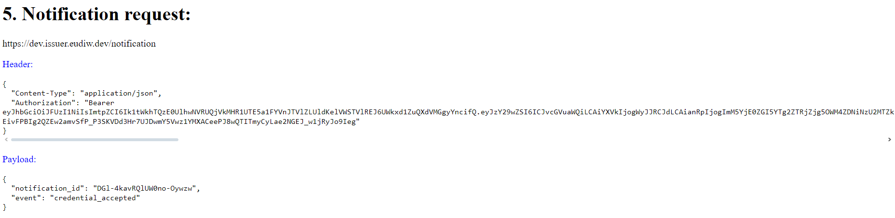

# Notification Request

This is an Optional Endpoint used by the Wallet to notify the Credential Issuer of certain events for issued Credentials. These events enable the Credential Issuer to take subsequent actions after issuance. 

**Endpoint**: <https://issuer.eudiw.dev/notification> (or <https://localhost/notification> if installed locally)

This data must be present in Json so that the request can be made:

Header:

+ *Content-Type* - *application/json*
+ *Authorization* - *Bearer token*
  
Payload:

+ *notification_id* - Received after a Batch Credential or Credential request
+ *event* - type of event that occurred

If everything goes well, a *HTTP/1.1 204 No Content* will be received in the Wallet

In the event of an error, *HTTP/1.1 400 Bad Request*, a JSON will be received with:

+ *error* - error description

