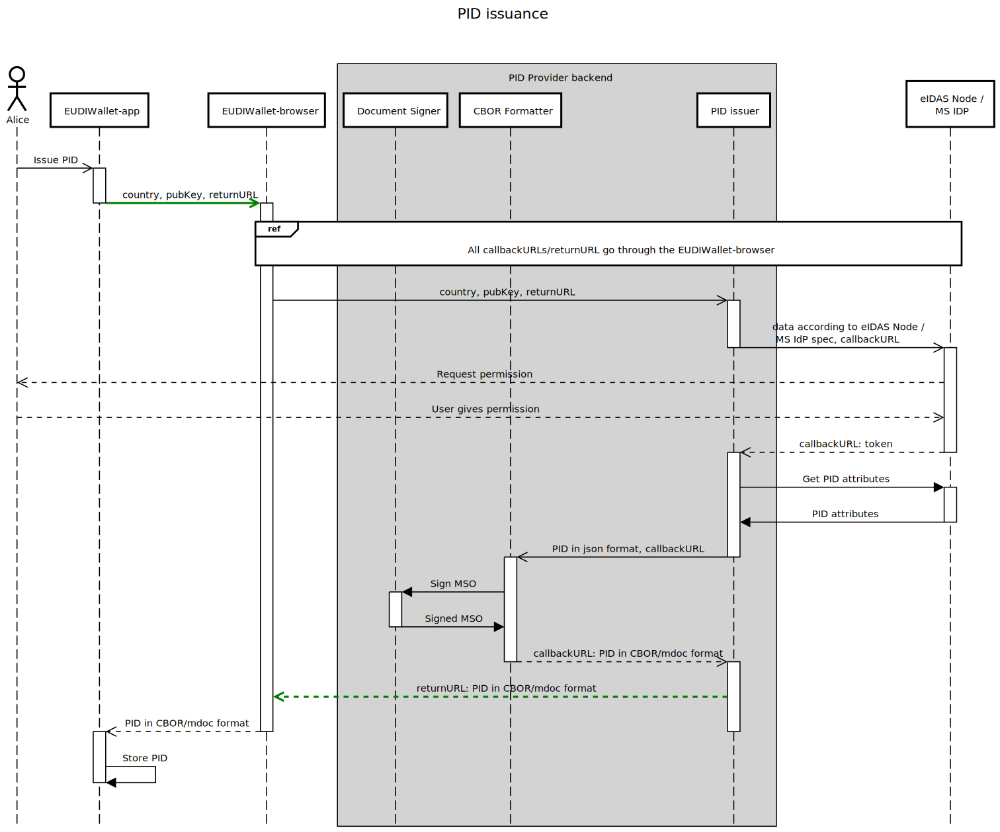

# PID issuer - version 0.3

The functionality of the PID issuer is defined in the issuing-pid repo.




## 1. Web Service APIs

+ Pre-production / tests URL: <https://issuer.eudiw.dev/>

### 1.1 Get PID in CBOR and SD-JWT format

Issues PID in CBOR (ISO 18013-5 mdoc) and SD-JWT format.

The request contains the API version, Issuer country, the EUDI Wallet device public key, a returnURL, and a certificate to cipher the mdoc and sd-jwt returned to the EUDI Wallet.
After receiving the request, the user's (EUDI Wallet holder) browser will be redirect to the Issuer country eIDAS Node (or to the Issuer country Identity Provider) to authenticate itself and to consent to share the PID attributes with the PID issuer.

After creating the signed PID in CBOR/mdoc and SD-JWT format, the PID issuer will redirect the user's browser to the returnURL (PID in CBOR/mdoc and SD-JWT format will be ciphered with the EUDI Wallet instance certificate).

#### 1.1.1 (GET) pid/getpid

Starts the process of issuance of the PID in CBOR (ISO 18013-5 mdoc) and SD-JWT format.

+ Pre-production / tests URL: <https://issuer.eudiw.dev/pid/getpid>

The **pid/getpid** GET request contains the following fields:

+ *version* (mandatory) - API version
+ *country* (mandatory) - Two-letter country code according to ISO 3166-1 alpha-2.
+ *certificate* (mandatory) - Wallet instance (device) certificate (PEM format) encoded in base64urlsafe format. The wallet instance public key will be:
  + may be validated, when the Wallet Issuer Trusted list (or similar) is available
  + used to encrypt fields *mdoc* and *sd_jwt* of the response (ECC-Based Hybrid Encryption + AES-256-GCM) sent to the returnURL (see section 1.1.2).
+ *device_publickey* (mandatory) - User's device public key (PEM format, base64 urlsafe encode). Will be included in the mdoc and sd-jwt, according the relevant standards.
+ *returnURL* (mandatory) - URL where the response will be redirected. If the returnURL is not present, an HTTP_400_BAD_REQUEST error will be returned.

Supported API *version*, for testing:

+ 0.2 - Only the cbor/mdoc format of the PID is issued. The SD-JWT format of the PID is not issued. (API not supported since 28/August/2023)
+ 0.3 - cbor/mdoc and sd-jwt format of the PID is issued


Available *country* codes, for testing:

+ FC (Form Country) - a form, with the necessary PID attributes, will be presented to the user (EUDI Wallet holder). The user will insert the values, that will not be verified;
+ CW (country W) - the user will be redirected to the eIDAS node of country W (the local [eIDAS node](https://ec.europa.eu/digital-building-blocks/wikis/display/DIGITAL/eIDAS-Node+version+2.6) must be installed in a local or remote server, and the [config file](../app/app_config/config_countries.py) must be changed accordingly);
+ CZ (Czech Republic) - the user will be redirected to the eIDAS node of Czech Republic (local eIDAS node must be configured to connect with Czech Republic eIDAS node, and the [config file](../app/app_config/config_countries.py) must be changed accordingly);
+ EE (Estonia) - the user will be redirected to the Identity Provider of Estonia (an agreement must be signed with the Estonian IdP, and the [config file](../app/app_config/config_countries.py) must be changed accordingly);
+ PT (Portugal) - the user will be redirected to the Identity Provider of Portugal (an agreement must be signed with the Portuguese IdP, and the [config file](../app/app_config/config_countries.py) must be changed accordingly).

For more information on how to use the PID Issuer test GUI to request a PID, please read the [support documentation](../support/suport.md))

Supported certificate algorithms and public key curves for testing:

+ Algorithm: ecdsa-with-SHA256 (OID: 1.2.840.10045.4.3.2), and EC Curve P-256 (secp256r1, OID: 1.2.840.10045.3.1.7)

Supported device public key algorithms for testing:

+ Algorithm: ecdsa-with-SHA256 (OID: 1.2.840.10045.4.3.2), and EC Curve P-256 (secp256r1, OID: 1.2.840.10045.3.1.7)


Example:

```https://issuer.eudiw.dev/pid/getpid?version=0.2&country=PT&certificate=MIIH6DCCBdCgAwIBAgIIO0P-pTW...&device_publickey=MIIT4dCCBpT0PTA...&returnURL=https://url.redirect.to/route```

#### 1.1.2 (GET) returnURL

Redirects the user's browser to the *returnURL* (described in section 1.1.1). The PID in CBOR and SD-JWT format is ciphered (ECC-Based Hybrid Encryption(using ECDH) + AES-256-GCM) with the public key in the *certificate* (described in section 1.1.1).

+ URL: *returnURL* (from pid/getpid - see section 1.1.1)

The **returnURL** GET response contains the following fields:

+ *mdoc* - PID in cbor/mdoc format (base64 encoded), ciphered with the public key in the *certificate* - ECC-Based Hybrid Encryption (using ECDH) + AES-256-GCM - (bytes encoded in base64urlsafe format).
+ *sd_jwt* - PID in sd-jwt format, ciphered with the public key in the *certificate* - ECC-Based Hybrid Encryption (using ECDH) + AES-256-GCM - (bytes encoded in base64urlsafe format).
+ *nonce* - random AES initialization vector (bytes encoded in base64urlsafe format).
+ *authTag* - MAC code of the encrypted text, obtained by the GCM block mode (bytes encoded in base64urlsafe format).
+ *ciphertextPubKey* - randomly generated ephemeral public key, that will be used to derive the symmetric encryption key, using the ECDH key agreement scheme. Public key in DER format, encoded in base64urlsafe format.
+ *error* - error number. 0 if no error. Additional errors defined below. If error != 0, all/some fields may have an empty value.
+ *error_str* - Error information.

Error codes (available in the [API error code file](error.md))


For more information on ECC-Based Hybrid Encryption (using ECDH) + AES-256-GCM please read [ECC Encryption / Decryption](https://cryptobook.nakov.com/asymmetric-key-ciphers/ecc-encryption-decryption). Remember that *ciphertextPubKey* \* *privKey* = *shared AES-256-GCM symmetric key*, where *privKey* is the private key of the Wallet Instance. The *shared AES-256-GCM symmetric key* shall be used to decrypt the *cbor* and *sd-jwt*.

Example:

```https://url.redirect.to/route?mdoc=VGVzdCBiYXNlNjQgZW5jb2Rlci4...&sd_jwt=NlNjQgRVGVzdCBiYXlciZW5jb24...&nonce=VGVzdCBlbmNvZGV0IHRvIEJhc2U2NC4&authTag=VGVzdCBlbmNvZGV0IHRvIEJhc2U2NC4&ciphertextPubKey=VGVzdCBlbmNvZGV0IHRvIEJhc2U2NC4&error_number=0&error_string=No%20error```

--------------

### 1.2 Get PID in CBOR and SD-JWT format (without UI/UX for the end user)

Issues PID in CBOR (ISO 18013-5 mdoc) and SD-JWT format.

In addition to section 1.1, the request contains the basic information for PID issuance (First name, Family name, Birthday, National person identifier).
After receiving the request, the PID is created in CBOR and SD-JWT format, and the PID issuer will redirect the user's browser to the returnURL (PID in CBOR and SD-JWT format will be ciphered with the public key in the *certificate*).

#### 1.2.1 (POST) pid/form

Issues the PID in CBOR (ISO 18013-5 mdoc) and SD-JWT format.

+ Pre-production / tests URL: <https://issuer.eudiw.dev/pid/form>

The **pid/getpid** POST request contains the following JSON body:

+ *version* (mandatory) - API version
+ *country* (mandatory) - Two-letter country code according to ISO 3166-1 alpha-2.
+ *certificate* (mandatory) - Wallet instance (device) certificate (PEM format) encoded in base64urlsafe format. The wallet instance public key will be:
  + may be validated, when the Wallet Issuer Trusted list (or similar) is available
  + used to encrypt fields *mdoc* and *sd_jwt* of the response (ECC-Based Hybrid Encryption + AES-256-GCM) sent to the returnURL (see section 1.1.2).
+ *device_publickey* (mandatory) - User's device public key (PEM format, base64 urlsafe encode). Will be included in the mdoc and sd-jwt, according the relevant standards.
+ *returnURL* (mandatory) - URL where the response will be redirected. If the returnURL is not present, an HTTP_400_BAD_REQUEST error will be returned.
+ *CurrentGivenName* - First name.
+ *CurrentFamilyName* - Family name.
+ *DateOfBirth* - Birthdate.
+ *PersonIdentifier* - National person identifier.

Supported API *version*, for testing:

+ see section 1.1.1

Available *country* codes, for testing:

+ see section 1.1.1

Supported certificate algorithms and public key curves for testing:

+ see section 1.1.1

Supported device public key algorithms for testing:

+ see section 1.1.1


Example:

POST to  <https://issuer.eudiw.dev/pid/form> with the following JSON body:

```
{'CurrentGivenName': 'John', 'CurrentFamilyName': 'Doe', 'DateOfBirth': '1974-04-25', 'PersonIdentifier': '11223344Ab', 'version': '0.2', 'country': 'FC', 'certificate': 'LS0tLS1CRUdJTiBDRVJUSUZJQ0FURS0tLS...', 'device_publickey': 'MIIT4dCCBpT0PTA...', 'returnURL': 'https://url.redirect.to/route'}
```

#### 1.2.2 (GET) returnURL

See section 1.1.2.

--------------

### 1.3 Get PID in CBOR and SD-JWT format (for development testing)

Issues PID in CBOR (ISO 18013-5 mdoc) and SD-JWT format.

For the request arguments, see section 1.1.
After receiving the request, a default mdoc will be ciphered (with no interaction with the user (EUDI Wallet holder)), and the PID issuer will redirect the user's browser to the returnURL (PID in CBOR and SD-JWT format will be ciphered with the public key in the *certificate*).

#### 1.2.1 (GET) pid/getpidtest

Starts the process of issuance of the PID in CBOR (ISO 18013-5 mdoc) and SD-JWT format.

+ Pre-production / tests URL: <https://issuer.eudiw.dev/pid/getpidtest>

The **pid/getpidtest** GET request is identical to the **pid/getpid** GET request (see section 1.1.1)

Supported API *version*, for testing, are the same supported for **pid/getpid** GET request (see section 1.1.1)

Available *country* codes, for testing: In **pid/getpidtest** GET request, the country codes are not validated.

Supported device public key algorithms, certificate algorithms and public key curves for testing, are the same supported for **pid/getpid** GET request (see section 1.1.1)

##### 1.2.1.1 default mdoc used in pid/getpidtest

```
o2d2ZXJzaW9uYzEuMGlkb2N1bWVudHOBo2dkb2NUeXBleBhldS5ldXJvcGEuZWMuZXVkaXcucGlkLjFsaXNzdWVyU2lnbmVkompuYW1lU3BhY2VzoXgYZXUuZXVyb3BhLmVjLmV1ZGl3LnBpZC4xhdgYWGykaGRpZ2VzdElEAGZyYW5kb21YIDPzeDNsEwoeLYqQdUGKuEu0_Jd9wM8qsw2sW3GRhfRXcWVsZW1lbnRJZGVudGlmaWVyamJpcnRoX2RhdGVsZWxlbWVudFZhbHVl2QPsajE5NjUtMDEtMDHYGFhmpGhkaWdlc3RJRAFmcmFuZG9tWCCaVRgkU6nWjgx39cHFBqKK4-sr_0zw_8h6HKPk5TcB5HFlbGVtZW50SWRlbnRpZmllcmtmYW1pbHlfbmFtZWxlbGVtZW50VmFsdWVmR2FyY2lh2BhYZaRoZGlnZXN0SUQCZnJhbmRvbVgg1ptSpfCS-hzN_aM6obVZJlMenhdVC-zteWZ6eHzsQ9xxZWxlbWVudElkZW50aWZpZXJqZ2l2ZW5fbmFtZWxlbGVtZW50VmFsdWVmamF2aWVy2BhYYKRoZGlnZXN0SUQDZnJhbmRvbVggMm_BtIFM2UN-4YiHUCpk3t77WN9Sc_e5qX3XX9Em9r1xZWxlbWVudElkZW50aWZpZXJrYWdlX292ZXJfMThsZWxlbWVudFZhbHVl9dgYWIOkaGRpZ2VzdElEBGZyYW5kb21YIMLpEDAFL3a-EyT-n3pn6sy3lxG33r3q30zVLlrYOZzmcWVsZW1lbnRJZGVudGlmaWVyaXVuaXF1ZV9pZGxlbGVtZW50VmFsdWV4JDQ3YzM3MWY2LTQzZTYtNGFiZi1iOGJhLWJjZGNlNDg3NDJiNmppc3N1ZXJBdXRoWQVmhEShATgioRghWQLfMIIC2zCCAmCgAwIBAgIUEnWUMdIuaZGZz_wFszHGRDvD2KkwCgYIKoZIzj0EAwMwPTEbMBkGA1UEAwwSSUFDQSBtREwgUm9vdCAtIDAxMREwDwYDVQQKDAhERyBDTkVDVDELMAkGA1UEBhMCTFUwHhcNMjMwNjIzMTgxMzI0WhcNMzIwOTE4MTgxMzIzWjA9MRswGQYDVQQDDBJJQUNBIG1ETCBSb290IC0gMDExETAPBgNVBAoMCERHIENORUNUMQswCQYDVQQGEwJMVTB2MBAGByqGSM49AgEGBSuBBAAiA2IABEjPs5Izj5B75nxdqkGvV2IC64Ep7G3Y7LltpOYDFGCKBehbdZccZAbnk2BeuaVDRNC2ugWrZR0B40Dub0SyBbYkaizuhWuOMjvuEL5B132Ld2xpuSg_oUtVsCVQ1CWB76OCAR8wggEbMBIGA1UdEwEB_wQIMAYBAf8CAQAwHwYDVR0jBBgwFoAUXBZ_XXh8J4gvJG1FywkwNocurC4wFQYDVR0lAQH_BAswCQYHKIGMXQUBBzA_BgNVHR8EODA2MDSgMqAwhi5odHRwczovL3ByZXByb2QucGtpLmV1ZGl3LmRldi9jcmwvaWFjYV9tZGwuY3JsMB0GA1UdDgQWBBRcFn9deHwniC8kbUXLCTA2hy6sLjAOBgNVHQ8BAf8EBAMCAQYwXQYDVR0SBFYwVIZSaHR0cHM6Ly9naXRodWIuY29tL2V1LWRpZ2l0YWwtaWRlbnRpdHktd2FsbGV0L2FyY2hpdGVjdHVyZS1hbmQtcmVmZXJlbmNlLWZyYW1ld29yazAKBggqhkjOPQQDAwNpADBmAjEA-wvXxJyMsj40FlVsgF3-mM20T5Oo0O3kP54N9jCexPDKU36gdFkLeHOFc49Gp8ebAjEA9XGy7IWZ-quHRJVCxmiEvZZQiqkKdgRSdcyzvpRSHLa0o9MLBWxxbek_QJ1xxsCmWQIW2BhZAhGmZ2RvY1R5cGV4GGV1LmV1cm9wYS5lYy5ldWRpdy5waWQuMWd2ZXJzaW9uYzEuMGx2YWxpZGl0eUluZm-jZnNpZ25lZMB0MjAyMy0wNy0xMFQxMDoxNjozMFppdmFsaWRGcm9twHQyMDIzLTA3LTEwVDEwOjE2OjMwWmp2YWxpZFVudGlswHQyMDI4LTA3LTA4VDEwOjE2OjMwWmx2YWx1ZURpZ2VzdHOheBhldS5ldXJvcGEuZWMuZXVkaXcucGlkLjGlAFggYL4vwjhr7mMuoTUxAfCTiHzfT6FxMxoGBcg6OtYStVsBWCALAep_yfo1DA4RbbrrxJqiye8wWJZPYHtJjllPO_d9tgJYIBtHgsyKCiaFwUSyezaWE-4MtmAMAG67SqDvXiYUoBHZA1ggZeynvlCW4VFzY_yEnGaLHTOsQb-IYF-YonL6XMlyM7cEWCBrL2Pk9DNc82ZmDpkb21x9d6OcBOtFfr7t79BvNcRBNG1kZXZpY2VLZXlJbmZvoWlkZXZpY2VLZXlYa6QBAiACIVgwDHZGoq8gsA0KIYqoBXuRAon9_CvFAZG5u5V7PIg-bvv59ickMU6w486W2OzMaTmMIlgwDTWFdbLUmiHaLrxFDbGr6OX9yi-YI3a8AyZyHSMmZroTpWRQ0ZFf_WqOW8I5DR93b2RpZ2VzdEFsZ29yaXRobWdTSEEtMzg0WGAjw2IEEbCpjIGxijVUBOV7gwJANX7TDuLmvwEG6Xw6kGlxzE33g6uNfIJufiTJMjsdSaikEZz8MrZvcGlZCEECEjKpAQGPismjmVuHxur13fn6iaqBmOb2WrdWj-T-Rv9sZGV2aWNlU2lnbmVkoGZzdGF0dXM
```

##### 1.2.1.2 default sd-jwt used in pid/getpidtest
```
eyJhbGciOiAiRVMyNTYiLCAidHlwIjogInZjK3NkLWp3dCJ9.eyJpc3MiOiAiVGVzdCBQSUQgaXNzdWVyIiwgImp0aSI6ICJkYzdiYTc3ZC0wZmE2LTRkY2ItYjgyYS0zN2I3MGUzMjgxYWEiLCAiaWF0IjogMTk1OTEsICJleHAiOiAxOTU5OCwgInN0YXR1cyI6ICJleGFtcGxlIiwgInR5cGUiOiAiZXUuZXVyb3BhLmVjLmV1ZGl3LnBpZC4xIiwgInZlcmlmaWVkX2NsYWltcyI6IHsidmVyaWZpY2F0aW9uIjogeyJfc2QiOiBbIjVFdWtMMTRHcmJtZ2YtaDhyZWEtbHdZeFM2QlNEQmUwQzRLZmV0cmVLeHMiXSwgInRydXN0X2ZyYW1ld29yayI6ICJlaWRhcyIsICJhc3N1cmFuY2VfbGV2ZWwiOiAiaGlnaCJ9LCAiY2xhaW1zIjogeyJldS5ldXJvcGEuZWMuZXVkaXcucGlkLjEiOiB7Il9zZCI6IFsiSHdqclAwQU9MZEduaWJfc2llX0hpS0ZQc1l2bE5KTXVsV3psV2tuY2JxNCIsICJQLTZaQ0p1SFY2TmtlbTlvYlF0QkNLbHVaNHZQcU1LQ0ZzMnVRUXNqbHFrIiwgIlIzaVBoQ0RzRmZNclNFNFpXcXFBbnRWMjhjMmY2QUduVTY4NFdzbnZ2cGsiLCAiVk0wNlJWc1RfaUQtVkJjN1JwWF9HWHZscUw3Y3pLWlpNTnl3Sjc0SXIyTSIsICJXNnk5MVJ2NlNsUWNlbkdPdjByaUk0U0tJMlQ5MlVVRUlaWXNjUHp3Y2s0IiwgIlc4a194ZlEtWmhTLVVmLWtMSm9fYy1KdWw1UGVzdWlYcTNFWlVJRDlsQmsiLCAiZl8tdHE0eDV5VXRlcW1fNXFiOUZSSmE4S3hxd0p6OHlINjM4S2tuY3JQTSJdfSwgImV1LmV1cm9wYS5lYy5ldWRpdy5ERS4xIjogeyJfc2QiOiBbImdMU2dHTngxS2w1RmlUcEpwb2tFUUxycjdTRmx4RTJ5aWVyYlUxWVdYU2siXX19fSwgIl9zZF9hbGciOiAic2hhLTI1NiIsICJjbmYiOiB7Imp3ayI6IHsia3R5IjogIkVDIiwgImNydiI6ICJQLTI1NiIsICJ4IjogInVGd0dNN1VuMDJHNUYxa0o1b3lZTXdyTnlUYUw0b0F6MXhmWm9xcnNSTVU9IiwgInkiOiAiVnRBMVZyVU9Wa1JoenFNVVN0aGNGNEw2QllRajdkUmk0TU1neVdydUtwOD0ifX19.7Yd1tbs5nWS8Z9RCbtDhdjYtw2Yl_pHBDL_tbupRQtaaMYK5nASOSYzb2PPL27Mb5Dth6iQ7cy2niBApe40_jA~WyJMSm5GX0hFS3hSd1FxYWpkY3d6WWZ3IiwgImV2aWRlbmNlIiwgeyJ0eXBlIjogImxpbmsgZG8gaXNzdWVyIiwgInNvdXJjZSI6IHsib3JnYW5pemF0aW9uX25hbWUiOiAiVGVzdCBQSUQgaXNzdWVyIiwgIm9yZ2FuaXphdGlvbl9pZCI6ICJJUEEgQ29kZSIsICJjb3VudHJ5X2NvZGUiOiAiRkMifX1d~WyJIYXpOYVlIcHpPRnAzeS1WZ2N0OEV3IiwgImZhbWlseV9uYW1lIiwgInVnYSJd~WyJLUDJ2SnY0clFMX1pHZm1RZ3dLb1RRIiwgImdpdmVuX25hbWUiLCAidWdhIl0~WyJwVVZtVDB0WE96VVZnWFJVOXVqZEJRIiwgImJpcnRoX2RhdGUiLCAiMjIyMi0wMi0yMiJd~WyJMd0ZzNzBVbzdPc2puR2hHOWltWTVRIiwgInVuaXF1ZV9pZCIsICJ1Z2EiXQ~WyJyX0hSakdHRHpvb3VXN09yOWFVT0FBIiwgImFnZV9vdmVyXzE4IiwgZmFsc2Vd~WyJwZ3BTRTNkR1hScVhEcVVuWUtVTGJnIiwgImlzc3VhbmNlX2RhdGUiLCAiMjAyMy0wOC0yMyJd~WyJxUWtoTnJRTXpnb3k2WVdiMER0QWRnIiwgImV4cGlyeV9kYXRlIiwgIjIwMjMtMDgtMzAiXQ~WyJRampZcng1a0ZIRlpVbTZraGdyaU1BIiwgInNpZ25hdHVyZV91c3VhbF9tYXJrIiwgImEzNjc3NjY1NzI3MzY5NmY2ZTYzMzEyZTMwNjk2NDZmNjM3NTZkNjU2ZS4uLiJd~
```
    

#### 1.2.2 (GET) returnURL

Redirects the user's browser to the *returnURL* (described in section 1.2.1). 

+ URL: *returnURL* (from pid/getpidtest - see section 1.2.1)

The **returnURL** GET response fields are the same as defined in section 1.1.2.

Error numbers are the same as defined in section 1.1.2.

#### 1.2.3 Testing

A special test case has be put in place in order to verify if the cipher/decipher are correctly implemented (certificate and private key pre-defined). Please use the following command line to test it:

```
curl -L -v -b "session=random" https://issuer.eudiw.dev/pid/getpidtest?version=0.3\&country=PT\&certificate=LS0tLS1CRUdJTiBDRVJUSUZJQ0FURS0tLS0tCk1JSUIzakNDQVlXZ0F3SUJBZ0lVWWJFTlJQN3VWOTUrQ3BBVlFDcHl6VmNRVmlVd0NnWUlLb1pJemowRUF3SXcKUlRFTE1Ba0dBMVVFQmhNQ1FWVXhFekFSQmdOVkJBZ01DbE52YldVdFUzUmhkR1V4SVRBZkJnTlZCQW9NR0VsdQpkR1Z5Ym1WMElGZHBaR2RwZEhNZ1VIUjVJRXgwWkRBZUZ3MHlNekEzTVRBeE1EUTFOVFZhRncweU5EQTNNRFF4Ck1EUTFOVFZhTUVVeEN6QUpCZ05WQkFZVEFrRlZNUk13RVFZRFZRUUlEQXBUYjIxbExWTjBZWFJsTVNFd0h3WUQKVlFRS0RCaEpiblJsY201bGRDQlhhV1JuYVhSeklGQjBlU0JNZEdRd1dUQVRCZ2NxaGtqT1BRSUJCZ2dxaGtqTwpQUU1CQndOQ0FBVHdnUkFHUGdKbDNkaUo5ZWVPcEdXMGdpSWtQcGFGa1RFU1E5U0E5SEw5akM1NFd3azNvOTZICkNxMjlUVVhQYlNkYjFseFFzck9ncUphQ0dJM0xmem5RbzFNd1VUQWRCZ05WSFE0RUZnUVV5VkgxV0drQ1FOcnoKNjJFTHkvd1lmekFRYVZVd0h3WURWUjBqQkJnd0ZvQVV5VkgxV0drQ1FOcno2MkVMeS93WWZ6QVFhVlV3RHdZRApWUjBUQVFIL0JBVXdBd0VCL3pBS0JnZ3Foa2pPUFFRREFnTkhBREJFQWlCYXZLbU5TSWxCWXh6TmcxdU1Fd3BJCkZGNlZFdmlRQllwWnNYYURvQmRhQ1FJZ00rZUFBUE5zNXErNnZ0SVR1R1pTUkdoN1U3U1VMdWNqWGZJNmU0N2IKSjI4PQotLS0tLUVORCBDRVJUSUZJQ0FURS0tLS0t\&returnURL=https://issuer.eudiw.dev/pid/returnpidtest\&device_publickey=LS0tLS1CRUdJTiBQVUJMSUMgS0VZLS0tLS0KTUZrd0V3WUhLb1pJemowQ0FRWUlLb1pJemowREFRY0RRZ0FFdUZ3R003VW4wMkc1RjFrSjVveVlNd3JOeVRhTAo0b0F6MXhmWm9xcnNSTVZXMERWV3RRNVdSR0hPb3hSSzJGd1hndm9GaENQdDFHTGd3eURKYXU0cW53PT0KLS0tLS1FTkQgUFVCTElDIEtFWS0tLS0t
```
