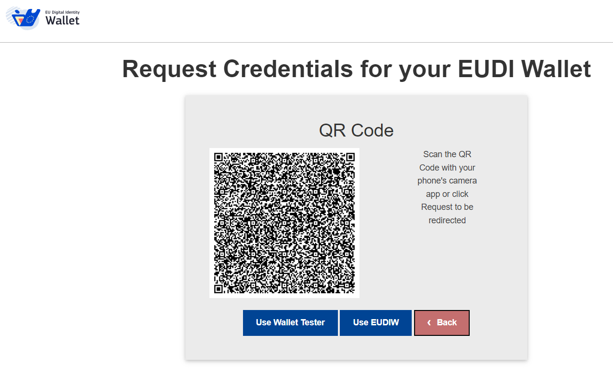

# Pre-authorized

For the pre-authorized flow, you can test our examples by selecting Pre-Authorization Code Grant in https://issuer.eudiw.dev/credential_offer (or <https://localhost/credential_offer> if installed locally).

After submitting, a QR code and DeepLink is generated:

   

```   
openid-credential-offer://?credential_offer=%7B%22credential_issuer%22:%20%22https://issuer.eudiw.dev/%22%2C%20%22credential_configuration_ids%22:%20%5B%22eu.europa.ec.eudi.loyalty_mdoc%22%5D%2C%20%22grants%22:%20%7B%22urn:ietf:params:oauth:grant-type:pre-authorized_code%22:%20%7B%22pre-authorized_code%22:%20%22Z0FBQUFBQm1WMWZTQUwySE5WSklFcTJ5WU5pNXRPZ3pjU0V2UXRJbUpRYnRiM3I0eEthVU5OSzZhMXpPSHE1M2ZFVHFnRG9ReXRwRm95MzBtaTVkQzk3U05lRE4xSExqSkQtNGV3QmhNS0pLaVRBTk9HTmdXa2t1c3liMFBJeE9JVUQwc1o0UjI1ZTdFZTFDRndFeFkwd094NEk5eC1sM2ozb0FUekQxTVdjc1plMGFUdXR0czd4TkVxZUh5LVJ0RGtXWmZLbFJ4LU1KMzNtN01qamIzTFp6cER4SVVnSUtzbk84dUJlbmxEQ3ZPUjk1N3VEZndvOFdweWZhQjJzbTJLZ1hvZ0NoLXNBVHNnU0VFSmJEQ0VPWUF6UHotRzIyQVFTWlFTLTBqSmdadm0tYm1wLTYzMDFwYW4wQnVVNUJjSmpubGdwVTZQMEFzUUxMcHdnSHRBZEhZR0FLVXRaelNCNklGbnhqSTRxS05VXzdXa3VqQUNSOXp6UG13N2VqOFlqYXVXQ2dnTUdybHNUSXZwYlpqSWVMLXhBVFlUTHgwVnZydkNsTUxIWGlvRUlibWtoWGNiY1BMdFZKbG1EX2ttU1EwMmZLZ2J5ekNoOEM2ZVJtanQ5VEZWZ3N2SC03SjB6cklBMGZrckpQYXo5aXY4ODVMcjRMbWcyU3JuV21VRkdRdF9CTC12Z3FfQVlYWk5mY2FtdDNuZEVsZmhkSkFZaF9uVEpoakNuY2ZQMzlTZUxnWUlIU3FiZjQ2a0hJNkM3SVRTbTRFaXJ3eUx5UEtjdzBWNTRZMWFPTllsMkFoczNCd1lqQTg1SzJGTEdfQWlLSjRtQUxIVTk5RU9NaXhSUUtoQVRIekFIMUlOUEdkWEpDTmNIRllPTDhTazdVMUFoMjlOemdlZVROYU1xTi1heFl3TVE9%22%7D%7D%7D
```
   
